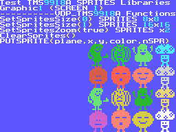
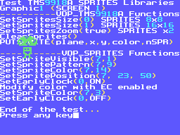

# VDP SPRITES MSX SDCC Library (fR3eL Project)

<table>
<tr><td>Name</td><td>VDP_SPRITES</td></tr>
<tr><td>Architecture</td><td>MSX</td></tr>
<tr><td>Environment</td><td>ROM, MSX-DOS, MSX BASIC</td></tr>
<tr><td>Format</td><td>SDCC Relocatable object file (.rel)</td></tr>
<tr><td>Programming language</td><td>C and Z80 assembler</td></tr>
<tr><td>Compiler</td><td>SDCC v4.4 or newer</td></tr>
</table>

---

## Description

C function library for directly accessing sprite attributes from the TMS9918A/28A/29A video processor.

Provides a set of sprite-specific functions, including positioning, color, pattern mapping, visibility, and set EarlyClock (horizontal shift left 32 pixels.).

This library need and complemented by one of the VDP TMS9918A access libraries from the fR3eL project:
- for all environments [VDP_TMS9918A](https://github.com/mvac7/SDCC_TMS9918A_Lib) Library. (Fast but takes up more space).
- for only ROM and MSX BASIC (Use BIOS) [VDP_TMS9918A_MSXBIOS](https://github.com/mvac7/fR3eL_VDP_TMS9918A_MSXBIOS_Lib) Library. (Small but slow).

You can combine the use of this library's functions with the PUTSPRITE function included in the VDP_TMS9918A library, which allows for a more agile way of initializing a Sprite.

This library is designed to be used only with TMS9918A VDP Sprites.
It can be used in Graphic 3 mode (Screen 4) on the V9938 or higher, but will not display correctly, as the color mapping and EarlyClock functions will not work because they must write to a separate color table. 
This functionality has not been added to this library to keep its size small.

You can use this library to develop applications for ROM, MSXBASIC or MSX-DOS environments, using the Small Device C Compiler [(SDCC)](http://sdcc.sourceforge.net/) cross compiler.

You can access the documentation here with [`How to use the library`](docs/HOWTO.md).

These libraries are part of the [MSX fR3eL Project](https://github.com/mvac7/SDCC_MSX_fR3eL).

This project is open source under the [MIT license](LICENSE).
You can add part or all of this code in your application development or include it in other libraries/engines.

Enjoy it!

 

---

### About the Sprite libraries

I'm developing several libraries for managing MSX sprites, considering different runtime environments (ROM, MSX-DOS, or MSX BASIC) and different requirements, such as compactness, optimality, or compatibility with V9938.
 
Regarding this last point, I found it interesting to be able to create libraries that take advantage of the sprites features in Graphic 3 mode (Screen 4), since MSX1 games can be created that look better when run on computers with V9938, without consuming too many resources.

These libraries focus more on hardware access and provide little improvement for video game development.
It's possible that, with what I've learned from developing these libraries, I could develop a library in the future that simplifies the handling of composite moving figures (multiple sprite planes).

 

---

## History of versions (dd/mm/yyyyy):
- v1.2 (11/07/2025) 
	- Update to SDCC (4.1.12) Z80 calling conventions.
	- Move PUTSPRITE function to VDP_TMS9918A library.
	- Merge UnsetEarlyClock functionality into SetEarlyClock.
	- Maintain the EarlyClock value in the SetSpriteColor function.
	- Compatibility with the VDP_TMS9918A_MSXBIOS library.
- v1.1 ???
- v1.0 (04/05/2019) First Version

 

---

## Requirements

### Applications for Compile:

- [Small Device C Compiler (SDCC) v4.4](http://sdcc.sourceforge.net/)
- [Hex2bin v2.5](http://hex2bin.sourceforge.net/)

 

### Libraries for include in your projects:

- fR3eL [VDP_TMS9918A](https://github.com/mvac7/fR3eL_VDP_TMS9918A_Lib) Library
- fR3eL [VDP_TMS9918A_MSXBIOS](https://github.com/mvac7/fR3eL_VDP_TMS9918A_MSXBIOS_Lib) Library

 

---

## Functions

| Name | Declaration | Description |
| :--- | :---        | :---        |
| SetSpritePattern  | `SetSpritePattern(char plane, char pattern)` | Assign a pattern to a sprite plane |
| SetSpriteColor    | `SetSpriteColor(char plane, char color)` | Assign a color to a sprite plane |
| SetSpritePosition | `SetSpritePosition(char plane, char x, char y)` | Assigns the position coordinates of a sprite plane |
| SetSpriteVisible  | `SetSpriteVisible(char plane, char state)` | Hides or shows a sprite plane |
| SetEarlyClock     | `SetEarlyClock(char plane, char state)` | Enable or Disable the EarlyClock of a sprite plane. Move 32 points to the left the X position of the sprite |

 

---

## Code Examples

The project includes several examples that I have used to test the library and that can help you learn how to use this library.

You can find them in the [`examples/`](examples/) folder.

 

### Example 1 (ROM)

Example included in the HOWTO document.

[`examples/Example01`](examples/Example01)

 

 

### Example 2 (ROM)

Example where the Sprite functions included in the VDP_TMS9918A_MSXBIOS and VDP_SPRITES libraries are tested.

[`examples/Example02_ROMwBIOS`](examples/Example02_ROMwBIOS)

 
 

 

### Example 3 (MSX-DOS)

Adaptation of Example 2 for the MSX-DOS environment.

Test the Sprite functions included in the VDP_TMS9918A and VDP_SPRITES libraries.

[`examples/Example03_MSXDOS`](examples/Example03_MSXDOS)
